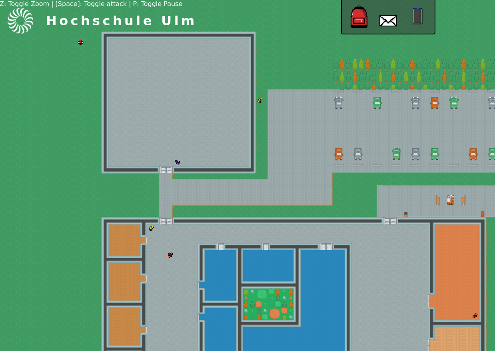
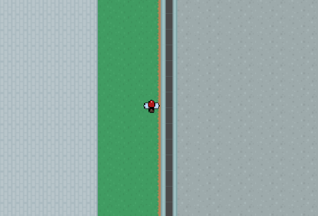
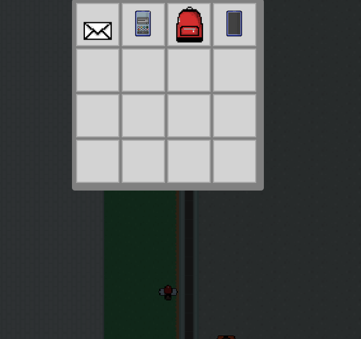

# HSU

The official HSU game. Play it in a modern browser!

## Gameplay and Features

The game is played by using the arrow keys or WASD to move your character around the map. 
You can zoom in or out by pressing "z"

There are icons that are part of the Heads Up Display (HUD).
You can bring up your current inventory by clicking on the backpack.

See our [roadmap](https://micah.dvyld.com/hsu/docs#roadmap) for details on what features are coming up next.

## Starting the game locally

Download and install [nodejs](https://nodejs.org/)

Download the repository (git clone)

    git clone https://github.com/micahh2/hsu

Change your current directory

    cd hsu

Install dependencies

    npm i

Start local http server

    npm start

Open your browser to http://localhost:8080

## Development

### Orienting yourself and your repository
1. Run `git status` to see the status of your local instance. If you are on a branch besides master, run `git checkout master` to switch to the master branch. If you have changes you don't want anymore try staging them with `git add` and using `git stash` to hide them for the moment.
1. Update your local master branch using `git pull` to get changes. Pay attention to the output, if there are merge conflicts they will show up here.
1. Start the local development server with `npm start`
1. In another terminal/console start the unit test runner with `npm test`
1. Read the card that your working on, make sure you understand it
1. Create a feature branch using `git checkout -b`, or `git branch` and `git checkout`. Try to give your branch a short but descriptive name.

### Developing your code
1. Identify changes to make
1. *(Optional)* Create tests that don't pass, but will when you've made the next step ([TDD](https://en.wikipedia.org/wiki/Test-driven_development))
1. Implement changes; check the unit test runner; reload your browser to see the changes
1. Repeat creating tests, and implementing functionality until the card is complete, or until you need to redefine the card to match how the feature will be implemented (e.g. break it up)

### Contributing your code
1. Double check all unit tests are passing
1. Lint the project using `npm run fix-lint`, if there are errors fix them
1. Use `git add` to stage files as ready for commit
1. Use `git commit` to create a commit with a useful message describing your changes
1. Use `git push` your new branch and use github's UI to create a pull request, don't forget to assign someone to merge the pull request. 
1. Celebrate 🎉 !!! You just contributed to the project!

## Testing

To start the test runner:

    npm test

To generate a test report (test-report.md)

    npm run test-report

View the test status' [here](https://micah.dvyld.com/hsu/docs#tests)

View the test code coverage [here](https://micah.dvyld.com/hsu/coverage/index.html)

## Documentation

Documentation can be found on the demo website [here](https://micah.dvyld.com/hsu/docs).

Building documentation

    npm run build-docs

Starting local server for documentation

    npm run serve-docs

## Linting

The project uses a lightly modified version of [Airbnb's eslint style guide](https://github.com/airbnb/javascript).
To run the linter and show errors:

    npm run lint

To run the linter and auto-fix simple mistakes:

    npm run fix-lint

While you do not need to do this before making a commit, it is encouraged.
There are also a number of [editor plugins](https://eslint.org/docs/user-guide/integrations#editors) that can show you linter errors and make it easier to write compliant code.

## License

This software is licensed under [AGPL](https://www.gnu.org/licenses/agpl-3.0.en.html)
